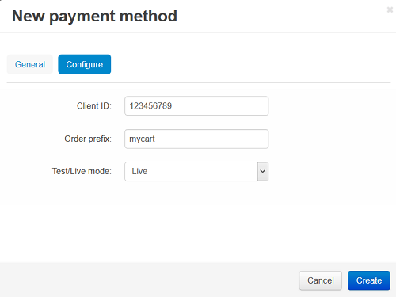

********************************
How To: Set up CS-Cart with eWAY
********************************

To set up CS-Cart with eWAY account:

*   In the Administration panel, go to **Administration > Payment methods**.
*   Click the **+** button on the right.
*   In the opened window:

    *   In the **Name** field type *eWAY*.
    *   In the **Processor** select box select *eWAY*.
    *   If necessary, specify other fields and upload an icon.

*   Open the **Configure** tab in the same window to view the eWAY settings.
*   Fill in the following fields:

    *   **Client ID** — enter the eWAY ID number.
    *   **Order prefix** — any prefix you want invoice IDs to have on eWAY site (optional field) (for instance, *mycart*). Using the prefix allows to prevent duplicate invoice IDs in case you use the same eWAY account for accepting payment from several websites;
    *   **Test/Live mode** — select *Live*. In order to use the *Test* mode you need to get additional accounts at eWAY Sandbox.

*   Click the **Create** button to save the changes.

