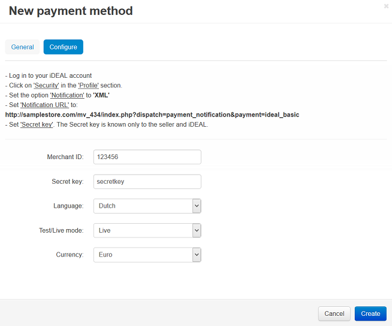

***************************************
How To: Set up CS-Cart with iDeal Basic
***************************************

*   In the Administration panel, go to **Administration → Payment methods**.
*   Click the **+** button on the right.
*   In the opened window:

    *   In the **Name** field type *iDeal Basic*.
    *   In the **Processor** select box select *iDeal Basic (ING)*.
    *   If necessary, specify other fields and upload an icon.

*   Open the **Configure** tab in the same window to view the iDeal Basic settings.

*   Fill in the following fields:

    *   **Merchant ID** — the iDeal Basic ING ID number.
    *   **Secret key** — your secret key.
    *   **Language** — select the language.
    *   **Test/Live mode** — select *Live mode*. To use *Test* mode, select *Test* in this select box.
    *   **Currency** — the currency in your iDeal account. If it does not match the base currency in your CS-Cart settings, please contact CS-Cart support team. 

*   Click the **Create** button to save the changes.

.. NOTE::

	Please set **Notification URL** to: *http://www.your_domain.com/your_cscart_directory/index.php?dispatch=payment_notification&payment=ideal_basic*
	where *www.your_domain.com* is the address of your store and where *your_cscart_directory* is the directory path relative to the web root directory.