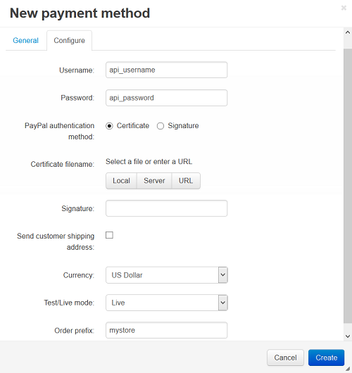

******************************************
How To: Set up CS-Cart with PayPal Express
******************************************

To set up CS-Cart with PayPal Website Express account:

*   In the Administration panel of your store, go to **Add-ons → Manage Add-ons** and make sure that the **PayPal payments** add-on is installed and configured.
*   Pay attention to the **PayPal order status conversion map** section. Here you can synchronize order status in your admin panel with the corresponding transaction status at PayPal.
*   Go to **Administration → Payment methods**.
*   Click the **+** button on the right.
*   In the opened window:

    *   In the **Name** field type *PayPal Express*.
    *   In the **Processor** select box select *PayPal Express Checkout*.
    *   If necessary, specify other fields and upload an icon.

*   Open the **Configure** tab in the same window to view the PayPal Express settings.
*   Fill in the following fields:

    *   **Username** — your PayPal Express API username.
    *   **Password** — your PayPal Express API password.
    *   **PayPal authentication method** — select the desired authentication method:

        *   If you select **Certficate**, upload a certificate file in the **Certificate filename** section. You are able to download the certificate in the **Profile → Request API credentials → option1 → Set up PayPal API credentials** section of your personal account at `www.paypal.com <http://www.paypal.com>`_ web site).

        *   If you select **Signature**, fill in the **Signature** field — enter your signature. You can find it in the **Permissions → option2 → View API Signature** section of your personal account at `www.paypal.com <http://www.paypal.com>`_ web site.

    *   **Send customer shipping address** — select this check box if you want to send the customer shipping address to PayPal.
    *   **Currency** — the currency in your PayPal account. If it does not match the base currency in your CS-Cart settings, please contact CS-Cart support team.
    *   **Test/Live mode** — select *Live* mode. In order to use *Test* mode you need to get additional accounts at `PayPal Sandbox <https://developer.paypal.com/>`_.
    *   **Order prefix** — any prefix you want invoice IDs to have on PayPal site (optional field) (for instance, *mycart*). Using the prefix allows to prevent duplicate invoice IDs in case you use the same PayPal account for accepting payment from several websites.
*   Click the **Create** button to save the changes.

.. important::

	Make sure that there are readable `permissions <http://docs.cs-cart.com/4.3.x/install/useful_info/permissions.html>`_ for the certificate file and for the directory where it is located on your server.

PayPal account settings:

If you want your customer to automatically return back to store after payment, at PayPal go to the **Profile → My selling tool** page and click the **Update** link near the **Website preferences** option. On the opened page set the **Auto Return** option as *Yes* and fill the **Return URL** input field by the following value:
*http://your_domain/index.php?dispatch=payment_notification.return&payment=paypal*

Do not touch any other settings on this page.

.. important::

	Use the **https** link (*https://your_domain/index.php?dispatch=payment_notification.return&payment=paypal*), if you have the secure connection enabled at checkout.