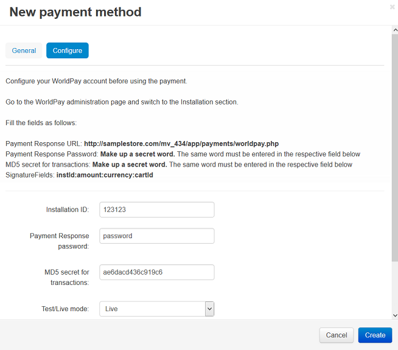

************************************
How To: Set up CS-Cart with WorldPay
************************************

To set up CS-Cart with WorldPay payment gateway:

*   In the Administration panel, go to **Administration > Payment methods**.
*   Click the **+** button on the right.
*   In the opened window:

    *   In the **Name** field type *WorldPay*.
    *   In the **Processor** select box select *WorldPay*.
    *   If necessary, specify other fields and upload an icon.

*   Open the **Configure** tab in the same window to view the WorldPay settings.
*   Fill in the following fields, as follows in the **Administration > Installation** page of your WorldPay account:

    *   **Installation ID** — your WorldPay installation ID number.
    *   **Payment Response Password**
    *   **MD5 secret for transactions**
    *   **Test/Live mode** — select *Live* mode. In order to use *Test* mode you need to select the *Test: Approved* value in this select-box.
    *   **Currency** —  the currency in your WorldPay account. If it does not match the base currency in your CS-Cart settings, please contact CS-Cart support team.
    *   **Type** — select *Fullauth* type.

.. important::

	The **Payment Response enabled** and **Enable the Shopper Response** settings must be enabled on your WorldPay settings page.

*   Click the **Create** button to save the changes.

.. note::

	Please use the following URL as the callback URL: *http://www.your_domain.com/your_cscart_directory/payments/worldpay.php*
	where *www.your_domain.com* is the address of your store and where *your_cscart_directory* is the directory path relative to the web root directory.