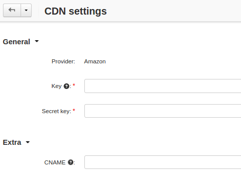

************
CDN Settings
************

**CDN** stands for `Content Delivery Network <https://en.wikipedia.org/wiki/Content_delivery_network>`_. You can specify the CDN parameters under **Administration → Storage → CDN settings**. The CDN used is `Amazon CloudFront <http://aws.amazon.com/cloudfront/>`_.

* **Key**—the identification key you get after registering at `aws.amazon.com <http://aws.amazon.com/cloudfront/>`_.

* **Secret key**—the secure key given to you after registering at `aws.amazon.com <http://aws.amazon.com/cloudfront/>`_.

.. note::

   `Learn more about getting the key and secret key <http://docs.aws.amazon.com/AWSSimpleQueueService/latest/SQSGettingStartedGuide/AWSCredentials.html>`_ from the Amazon Web Services documentation.

* **CNAME**—the domain name that you want to use instead of the CloudFront domain name for the URLs for your files. You need to create a CNAME record with your DNS service to route queries to the CloudFront host (it will be displayed on this page after you enter the account information).

.. important::

    If you use secure connection in your store (either in the administration panel or on the storefront), you also should upload the SSL certificate for this domain name to Amazon Cloudfront. `Learn more <http://docs.aws.amazon.com/AmazonCloudFront/latest/DeveloperGuide/SecureConnections.html#cnames-and-https-procedure>`_ from the Amazon Web Services documentation.

