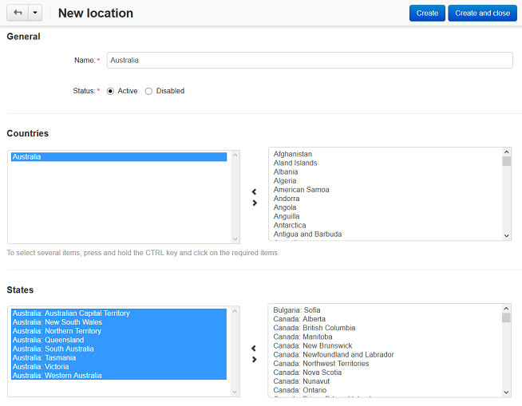

*********************************
How To: Set up a Country Location
*********************************

To set up a location for a particular country:

*   In the Administration panel, go to **Administration → Shipping & Taxes → Locations**.
*   Add a new location zone by clicking the **+** button on the right of the page (for example, you wish to define the location zone *Australia*).
*   Select *Australia* in the **Countries** section on the right side and click the **<** icon to move it to the left box.
*   Select all the **Australian states and territories** (e.g. *Australia: New South Wales* and *Australia: Australian Capital Territory*) in the **States** section on the right side and click the **<** icon to move them to the left box.

.. important::

	If the country has states, provinces, or counties you should necessarily add them to the left section. If the country does not have any administrative-territorial entities leave the **States** section blank on the left.

*   Leave other fields blank on the left.
*   Click the **Save** button.

