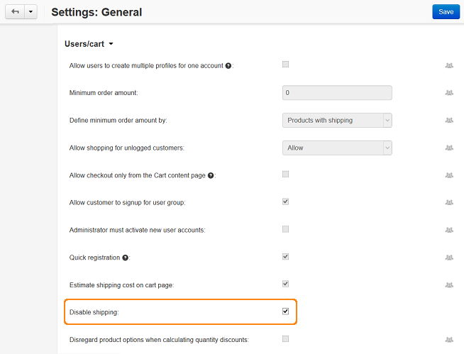

******************************************
How To: Disable Shipping on the Storefront
******************************************

To disable shipping on the storefront:

1. In the Administration panel, go to **Administration → Shipping & Taxes → Shipping methods**.
2. Switch the statuses of all the shipping methods to **Disabled**.

.. note::

    After that shipping methods will not be required and customers will be able to place an order without selecting a shipping method. In this case the shipping freights will also be ignored.
