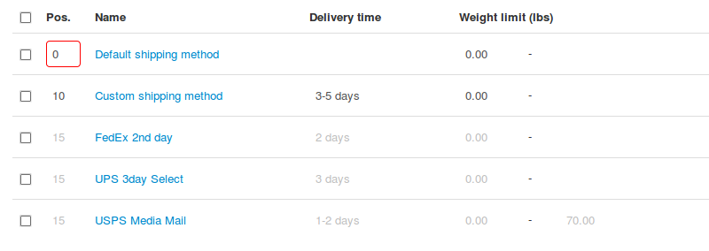
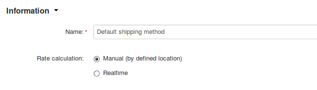
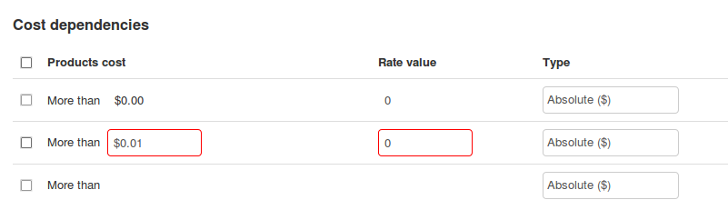

************************
Methods of Free Shipping
************************

The **Free shipping** checkbox on the **Shipping Properties** tab under **Products → Products → <Desired Product>** works differently, depending on the version of CS-Cart.

============
Before 4.3.5
============
Products with the ticked **Free shipping** checkbox did not require shipping and were excluded from the shipping fee calculation.

You could turn off the shipping method selection dialogue by ticking the **Disable shipping** checkbox under **Settings → General**.

If a customer placed an order that included only products with the **Free shipping** checkbox ticked, there were some issues:

*  The customer didn’t get the information about the shipping method

*  The customer couldn’t select the most convenient shipping method (for example, a faster, but paid shipping)

*  The order didn’t get `a tracking number <https://en.wikipedia.org/wiki/Tracking_number>`_, because technically it didn’t require shipping

=====================
Improvements in 4.3.5
=====================

All the products other than digital require shipping. If an order requires shipping, the customer must choose a shipping method.

A new **Use for free shipping** checkbox under **Administration → Shipping & taxes → Shipping methods → <Desired Shipping Method>** allows you to use a shipping method for free shipping.

.. image:: img/free_shipping/free_shipping.png
    :align: center
    :alt: The new Use for Free Shipping checkbox determines if you can use a shipping method for free shipping.

Tick the **Use for free shipping** checkbox, if you want to exclude the products with the enabled **Free shipping** option from the shipping price calculation. Then CS-Cart will calculate the shipping price for other products from the order in accordance with **Shipping charges**.

If you leave the checkbox unticked, CS-Cart will calculate the shipping price for all the products from the order in accordance with **Shipping charges**.

The **Disable shipping** checkbox under **Settings → General** has been removed: a product that requires shipping must have a shipping method.

================================================
Making 4.3.5 Shipping Methods Work Like in 4.3.4
================================================

If you don’t want to assign a shipping method to orders at all, go to **Administration → Shipping & taxes → Shipping methods** and either delete all the shipping methods, or change their status to **Disabled**.

If you want to offer free shipping and don’t want a user to choose a shipping method, complete the following steps:

1. Go to **Settings → Checkout** and untick the **Display "Shipping method" step** checkbox

2. Go to **Administration → Shipping & taxes → Shipping methods** and either create a new shipping method, or adjust an existing method as follows:

*   set the minimal **Position** possible (for example, 0) to make the method come first on the list

*   set the **Rate calculation** to Manual

*   switch to the **Shipping Charges** tab and configure the charges so that the **Rate value** for the shipping method equals 0

*	Click the **Save** button.