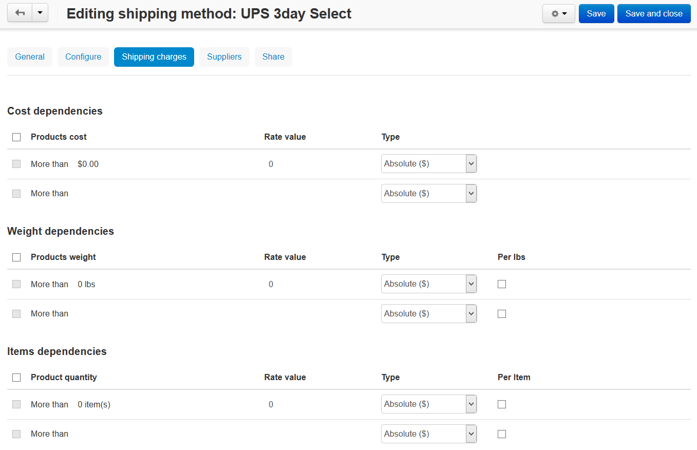

*******************************
Getting Incorrect Shipping Cost
*******************************

Check whether an additional shipping charge is set up for your products:

*	In the Administration panel, go to **Products → Products**.
*   Choose the product for which the shipping cost is displayed incorrectly.
*   Open the **Shipping Properties** tab and check the **Shipping freight ($)** option. If you would not like that the additional cost is added to the shipping cost for this product, the input field of this option should be empty. In this way enter **0** and click the **Save and close** button.

.. image:: img/freight_01.png
    :align: center
    :alt: Shipping freight

If a realtime shipping method is set up, check whether an additional charge is set up for it:

*   Go to **Administration → Shipping&Taxes → Shipping Methods**.
*   Click on the name of the real time shipping method.
*   Open the **Shipping charges** tab, check whether rates are set up in the **Cost dependences**, **Weight dependences**, and **Items dependences** sections. If any rates are set up there, they will be added to the shipping cost which will be transferred from the website of a real time shipping service (for instance UPS, USPS, etc.) If you would not like to add the rates to the shipping cost, remove them and click the **Save and close** button.

