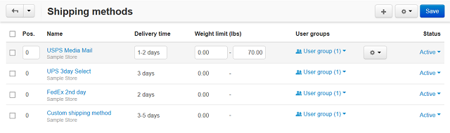

****************
Shipping Methods
****************

A shipping method is a set of rules and parameters to calculate the cost of shipping orders to buyers. This section contains an editable list of shipping methods present in the store.

In the list, you can quickly edit certain attributes of a shipping method. To access more attributes, click on the method name or the gear button which corresponds to the required shipping and choose **Edit** from the drop-down list.

.. toctree::
    :maxdepth: 2
    :titlesonly:
    :glob:

    */index
    *