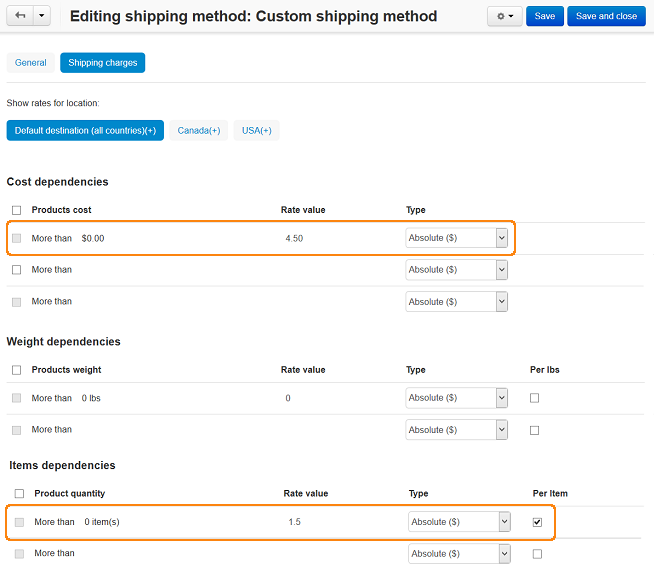
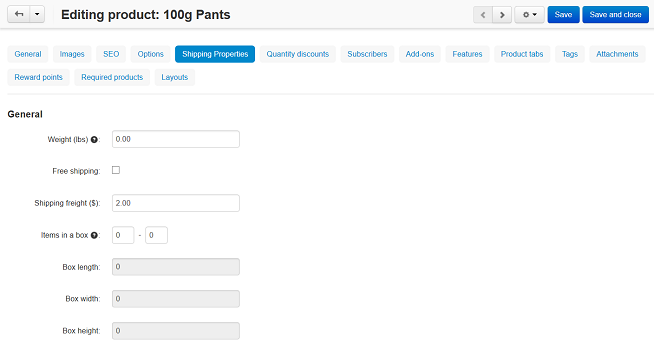

*****************************************************************************************
How To: Set One Shipping Cost for the First Item and Another One for Each Additional Item
*****************************************************************************************

*   In the Administration panel, go to **Administration > Shipping & Taxes > Shipping methods**.
*   Create a new shipping method or choose the existing one and click on its name.
*   On that page open the **Shipping charges** tab.
*   Select the desired location in the **Show rates for location** box. If you don't see this checkbox, it means that you haven't defined any locations. Learn how to do it `here <http://docs.cs-cart.com/4.3.x/user_guide/shipping_and_taxes/locations/index.html>`_.
*   In the **Cost dependencies** section, in the **More than $** input field enter 0 and into the input field next to it define the price for the first item (e.g. 4.50).
*   Click the **Save** button.
*   In the **Items dependencies** section, enter 0 into the **More than.. items** input field and additional charge for the first and each additional item (e.g. 1.50) into the input field next to it. Select the check box next to **Absolute ($)** in the row.
*   Click the **Save** button.

The shipping method is set up. For the mentioned example the shipping cost will be $6 if one item is ordered and extra $1.50 will be added to the cost per each additional item in case of 2 or more items.

.. note:: 

	This extra charge does not depend on the ordering products. For example, if a customer adds the third product to the cart and it is different from the first two, additional charge for it will be $1.50 anyway.

Also there is an ability to define additional shipping freight for a product which will be added to the calculated shipping cost for each ordered item:

*   Go to **Products > Products**.
*   Click on the name of a product.
*   On the **Editing product** page open the **Shipping properties** tab and enter cost (e.g. 2.00) which will be added to the shipping cost for each additional product in the **Shipping freight** input field.

.. note::

	Fill in the input field for **all** products that will have such additional shipping charges.

*   Click the **Save** button.

As a result of defining the shipping freight, the shipping cost will be $8 ($6 + $2) if one item is ordered and $3.50 ($1.50 + $2.00) will be added to the cost per each additional item in case of 2 or more items.