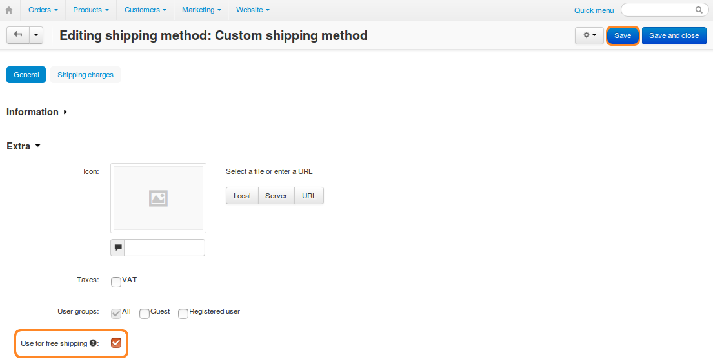

***********************************************
How To: Set Free Shipping for a Certain Product
***********************************************

.. note::

    **Tutorial Difficulty: 1 / 3**

1. In the Administration panel, go to **Products → Products**.

2. Click the name of the necessary product to edit it.

3. Open the **Shipping properties** tab on the opened page.

4. Tick the **Free shipping** checkbox.

5. Click the **Save** button.

.. image:: img/certain_product.png
    :align: center
    :alt: Product editing page

6. If you use CS-Cart & Multi-Vendor 4.3.5 or higher, you also need to configure the shipping method:

   * Go to **Administration → Shipping & taxes → Shipping methods**.

   * Click the name of the shipping method you want to edit.

   * Tick the **Use for free shipping** checkbox.

   * Click **Save**.

.. hint::

    Learn more :doc:`how free shipping works in different versions <../free_shipping>`.

.. hint::

    You can also enable free shipping for products using :doc:`product import <../../../manage_products/import_export/product_import>`. The description of the correct format can be found :doc:`in this article <../../../manage_products/import_export/fields_format>`.

