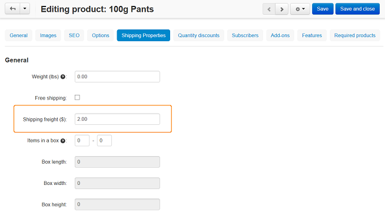

**************************************************************
How To: Set up Different Shipping Costs for Different Products
**************************************************************

*	In the Administration panel, go to **Products > Products**.
*	Click on the link corresponding to the necessary product.
*	Сhoose the **Shipping properties** tab on the opened page.
*	Enter the desired shipping cost in the **Shipping freight** input field.

*	Click the **Save** button.
*	Repeat points 2-5 for other products.
*	Create a :doc:`free shipping method <../manual_shipping_methods/set_free_shipping>`.

.. important::

	The value of the **Shipping freight** field is added to the shipping rates of the shipping method.