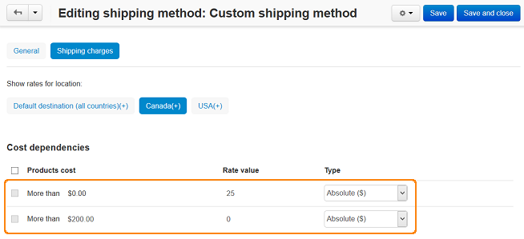

**************************************************************************
How To: Set Free Shipping for an Order Which Total is More Than Some Value
**************************************************************************

*   In the Administration panel, open **Administration > Shipping & Taxes > Shipping methods**.
*   Choose the shipping method on this page and click on the name of this shipping method.
*   On the details page of this shipping method open the **Shipping charges** tab.
*   Choose the location in the **Show rates for location** box for which free shipping will be defined.
*   In the **Cost dependencies** section in the first row enter 0 (for instance) into the **More than $** input field and a nonzero shipping cost (e.g. 25) into the input field next to it.
*   In the following row enter the total amount for which the shipping cost will be free into the **More than $** input field and 0 into the input field next to it.
*   Click the **Create** button.

.. important::

	If you have shipping rates defined in the **Weight dependencies** or **Items dependencies** sections for the same shipping method, it will not be free. The shipping method will display the rates defined in these sections.

