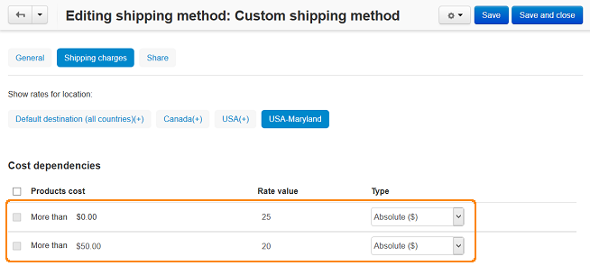

***************************************************
How To: Make Shipping Cost Dependent on Order Total
***************************************************

To set a shipping cost depending on order total:

*   In the Administration panel, go to **Administration → Shipping & Taxes → Shipping methods**.
*   :doc:`Create a new shipping method <../manual_shipping_methods/set_manual_shipping>` or choose the existing one.
*   Click on the name of this shipping method. The **Editing shipping method** page will open.
*   On that page open the **Shipping charges** tab.
*   Select the desired location in the **Show rates for location** box.
*   In the **Cost dependencies** section in the first row enter 0 (for instance) into the **More than** input field and a shipping cost (e.g. 25) into the input field next to it.
*   In the following row enter the total amount (e.g 50) after which you would like to change the shipping cost into the **More than** input field and different shipping cost (e.g. 20) into the input field next to it.

.. note::

	In this case if the order total is between $0 and $50, the shipping cost will be $25, and if the order total exceeds $50, the shipping cost will be $20.

*   You are able to specify as many intervals as you like.
*   Click the **Create** button.

