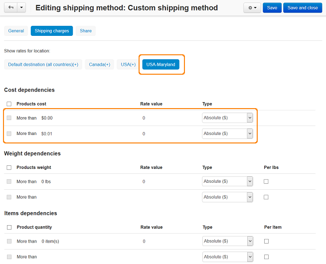

*************************************
How To: Set up a Free Shipping Method
*************************************

*	In the Administration panel, go to **Administration > Shipping & Taxes > Shipping methods**.
*	Add a new shipping method or choose the existing one.

.. important::

	This method should use the manual rate calculation (the **Rate calculation** option is set to *Manual* (by defined location) on the details page of a shipping method).

*	Click on the name of this shipping method to edit it. The **Editing shipping method** page will open.
*	Open the **Shipping charges** tab on the details page of this shipping method and choose the location in the **Show rate for location** box for which free shipping will be defined.
*	Enter *0.01* into **More than $** input field in the **Cost dependencies** form and enter *0* into next to it.

.. important::

	Make sure that there are no charges defined in the **Weight dependencies** and **Items dependencies** sections for this shipping method.

*	Click the **Create/Save** button.

