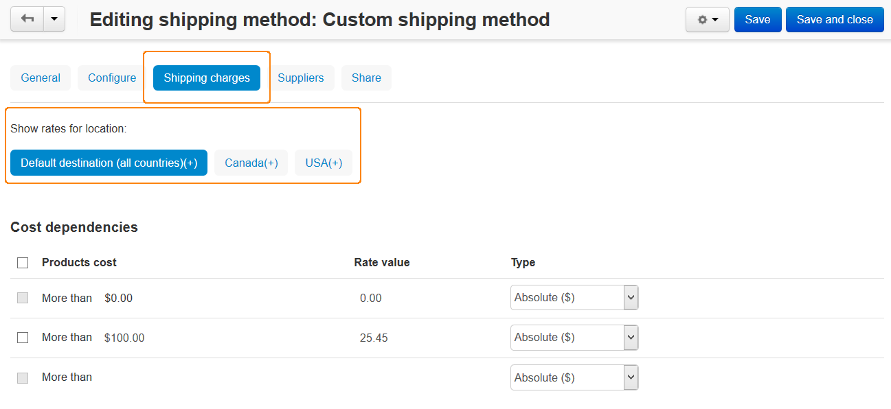

***************************************
Manual Shipping Method is Not Displayed
***************************************

To check the `manual shipping method <http://docs.cs-cart.com/4.3.x/user_guide/shipping_and_taxes/shipping_methods/manual_shipping_methods/set_manual_shipping.html>`_:

*   In the Administration panel, go to the **Administration → Shipping & Taxes → Locations** section and check whether a `location <http://docs.cs-cart.com/4.3.x/user_guide/shipping_and_taxes/locations/set_location.html>`_ is set up properly.

    *   Check whether geographic areas (states or countries) of location zones do not intersect with each other.
    *   Check whether the states (if they exist) are selected on the location details page.

*   Go to **Administration → Shipping & Taxes → Shipping methods** and choose the desired shipping method. On the opened page:

	*	Open the **Shipping rates** tab and check if the necessary location is selected in the **Show rates for location** box and the rates are set up for it.

