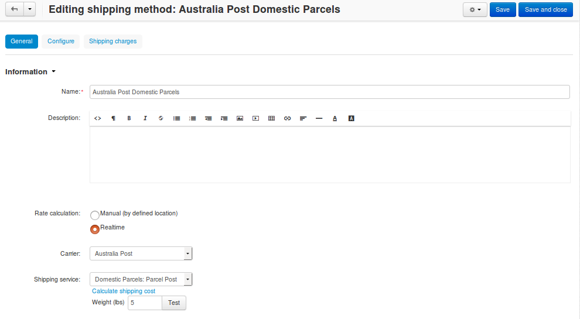

****************************************
How To: Set up Australia Post in CS-Cart
****************************************

.. note::

    **Tutorial Difficulty: 1 / 3**

    If you used an Australia Post shipping method and then upgraded to CS-Cart/Multi-Vendor 4.3.8, make sure to configure the shipping method again.

.. important::

    If you use CS-Cart/Multi-Vendor 4.x that is earlier than 4.3.8, `follow these instructions <http://forum.cs-cart.com/tracker/issue-6358-bug-in-australia-post-shipping-service-options-and-real-time-shipping-calculation-service/?gopid=25143#entry25143>`_. 

Follow these steps to set up a shipping method that uses `Australia Post <http://auspost.com.au/>`_:

================================
Step 1. Create a Shipping Method
================================

1.1. In the Administration panel, go to **Administration → Shipping & Taxes → Shipping methods**.

1.2. Create a new shipping method or click the name of an existing shipping method.

1.3. Set **Rate calculation** to *Realtime*.

1.4. Set **Carrier** to *Australia Post*.

1.5. Choose the desired **Shipping service**.

1.6. Configure other general settings as you see fit.

.. hint::

    Make sure to set the **Status** to *Active*, or the shipping method won't appear at checkout.

.. image:: img/australia_post_service.png
    :align: center
    :alt: Choose Australia Post as a carrier and select the desired shipping service.

=====================================
Step 2. Configure the Shipping Method
=====================================

2.1. (optional) Switch to the **Shipping charges** tab and define shipping charges. These charges will be added to the ones calculated by Australia Post.

2.2. Switch to the **Configure** tab. Depending on your version of CS-Cart/Multi-Vendor, the settings will be different.

     .. hint::

         If you don’t see any tabs, then the shipping method probably hasn't been created yet. Click **Create**, and the tabs should appear.

2.3. Enter your PAC API key.

     .. note::

         PAC stands for Postage Assessment Calculator. `Get PAC from Australia Post. <https://developers.auspost.com.au/apis/pacpcs-registration>`_

2.4. Specify the dimensions of the package:

     * **Package width (cm)** 

     * **Package height (cm)**

     * **Package length (cm)**

     .. hint::

          Check out `Australia Post Size and Weight Guidelines. <http://auspost.com.au/parcels-mail/size-and-weight-guidelines.html>`_ 

.. image:: img/australia_post_service.png
    :align: center
    :alt: Enter your API key for Postage Assessment Calculator and specify the dimensions of the package.

=================================
Step 3. Test Your Shipping Method 
=================================

3.1. Once you've configured the shipping method, click **Save**.

3.2. Return to the **General** tab.

3.3. Click **Calculate shipping cost** link.

3.4. Enter the desired value into the **Weight (lbs)** input field, and click the **Test** button to make a test calculation of shipping charges.

