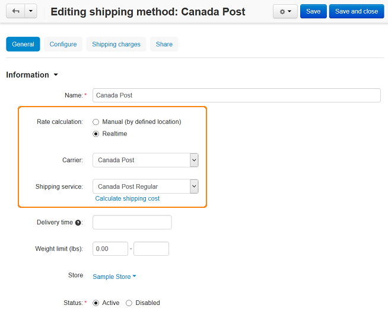

***************************************
How To: Set up CS-Cart with Canada Post
***************************************

Follow these steps to set up Canada Post:

*   In the Administration panel, go to **Administration > Shipping & Taxes > Shipping methods**.
*   Create a shipping method or choose the existent one.
*   Click on the name of the shipping method to modify it.
*   In the **Rate calculation** field select *Realtime*, in the **Carrier** field select *Canada Post*, and in the **Shipping service** field select *Canada Post Regular*.

*   Open the **Configure** tab. Fill in the **Merchant ID** (your merchant identifier), **Package width (cm)**, **Package height (cm)**, and **Package length (cm)** input fields.

.. image:: img/canada_post_02.png
    :align: center
    :alt: DHL

.. note::

	 The length of the greatest linear dimension of a parcel must not exceed **105cm** and the girth of a parcel must not exceed **140cm**.

*   Click the **Save** button.
*   Open the **Shipping charges** tab and define shipping charges which will be added to the ones defined by real-time shipping service. Click **Save**.
*   Open the **General** tab, click the **Calculate shipping cost** link, enter the desired value into the **Weight (lbs)** input field, and click the **Test** button to make a test calculation of shipping charges.