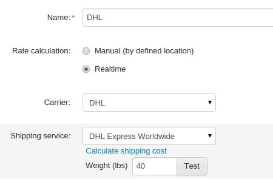

*************************************
How To: Configure DHL Shipping Method
*************************************

.. important::

    This article is based on **CS-Cart 4.3.5**: in earlier versions CS-Cart supported DHL only for the United States.

To configure a shipping method that uses DHL delivery services, complete the following steps:

1. Go to **Administration → Shipping & Taxes → Shipping methods**.
2. Create a new shipping method or сlick the existing method to modify it.

.. hint::

    If you have created a new shipping method and want to hide it until you configure in properly, set the method’s **Status** to **Disabled** on the **General** tab and click **Save**.

3. Name the shipping method.

4. Set **Rate calculation** to **Realtime**.

5. Select **DHL** in the **Carrier** drop-down menu.

6. Select the desired **Shipping service** (for example, DHL Express Worldwide).

.. image:: img/dhl_general.png
    :align: center
    :alt: Name your shipping method and choose your Carrier and Shipping service.

7. Switch to the **Configure** tab.

.. important::

    Swithching to other tabs is only available for existing shipping methods, so click **Create** if you don’t see the **Configure** tab.

8. Enter your **Site ID**, **Password** and **Account number**.

9. Define the dimensions and **maximum weight** of the box.

.. image:: img/dhl_configure.png
    :align: center
    :alt: Specify the DHL-specific settings on the Configure tab.

10. Switch to the **Shipping charges** tab.

11. Define a sum to add to the charges calculated by DHL.

.. image:: img/dhl_charges.png
    :align: center
    :alt: Specify any additional charges on the Shipping charges tab.

12. Click **Save**.

13. Open the **General** tab.

14. Click the **Calculate shipping cost** link.

15. Enter the desired value into the **Weight (lbs)** input field.

16. Click the **Test** button and check that the calculated shipping cost is correct.

.. important::

    DHL uses the currency of the sender’s country to calculate shipping costs. Set your store’s primary currency under **Administration → Currencies → <Desired Currency>** to match the DHL currency determined by **Account number**.

