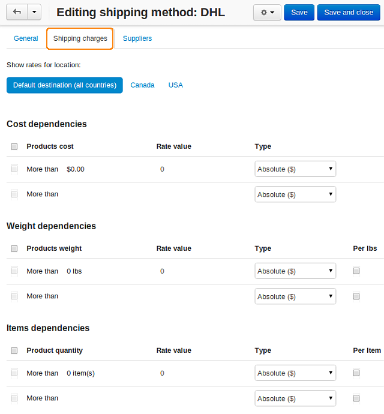

*****************************************************
Extra Amount to the Cost of Real Time Shipping Method
*****************************************************

*   In the Administration panel, go to **Administration → Shipping & Taxes → Shipping methods**.
*   Click on the name of the desired real time shipping method.
*   Open the **Shipping charges** tab, enter the desired rates there, and click the **Save** button. These rates will be added to the shipping cost defined by the real time shipping service (for instance FedEx, UPS, etc.)

