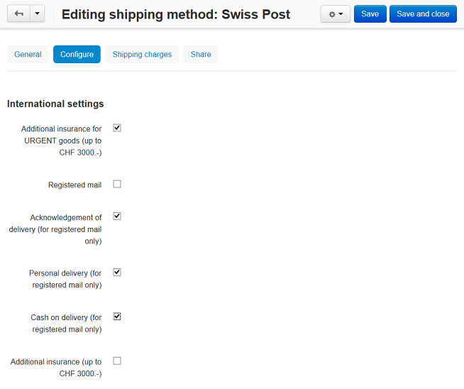

**************************************
How To: Set up CS-Cart With Swiss Post
**************************************

*   In the Administration panel, go to **Administration > Shipping & Taxes > Shipping methods**.
*   Create a shipping method or choose the existent one.
*   Click on the name of a shipping method to modify it.
*   Select *Realtime* in the **Rate calculation** field, select *SwissPost* in the **Carrier** field, and *Swiss Post International PostPac PRIORITY* in the **Shipping service** field.

.. image:: img/swiss_post_01.png
    :align: center
    :alt: New shipping method

*   Open the **Configure** tab and select the necessary options there.

*   Open the **Shipping charges** tab and define shipping charges which will be added to the ones returned by real-time shipping service if it is needed.
*	Click the **Save** button to save the changes.
*   Open the **General** tab, click the **Calculate shipping cost** link, enter the desired value into the **Weight (lbs)** input field, and click the **Test** button to make a test calculation of shipping charges.