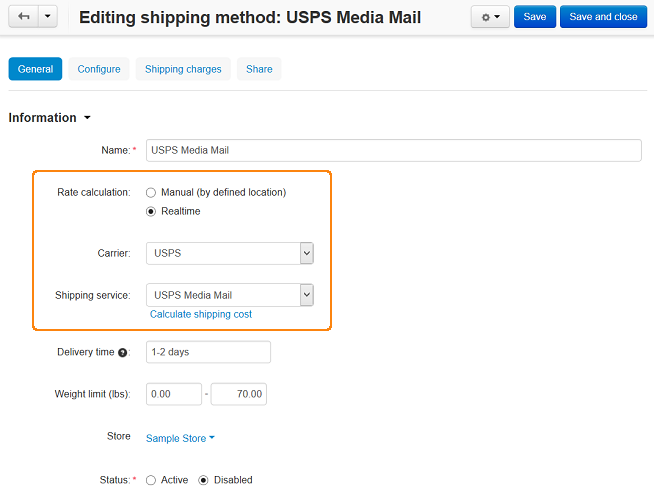
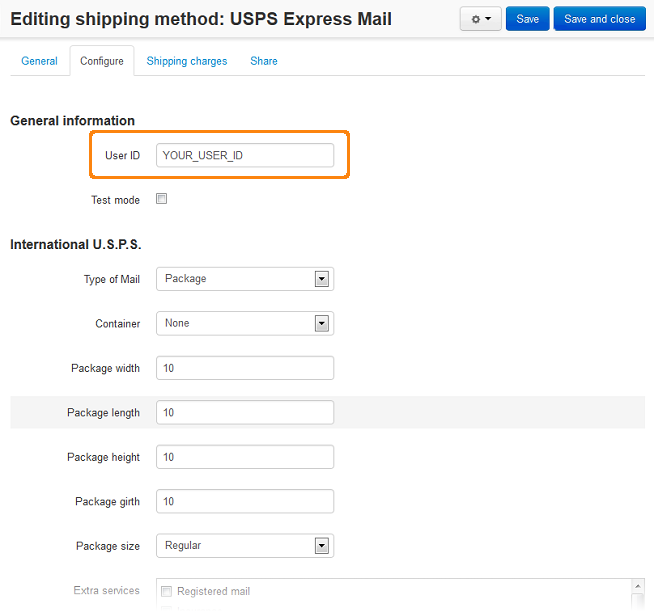

********************************
How To: Set up CS-Cart with USPS
********************************

*   In the Administration panel, go to **Administration > Shipping & Taxes > Shipping methods**.
*   Create a shipping method or choose the existing one.
*   Click on the name of the shipping method to modify it.
*   In the **Rate calculation** field select *Realtime*, in the **Carrier** field select *USPS*, and in the **Shipping service** field select *USPS Media Mail* (or another USPS service).

*   Open the **Configure** tab and set up the necessary options there. Fill your USPS credentials in the **User ID** field. If you do not have any, you need to sign up for the USPS User ID `here <https://www.usps.com/business/web-tools-apis/welcome.htm>`_.

.. important::

    You should confirm your USPS User ID before using it. Call USPS (800-344-7779 FREE) to activate your account on the production servers. It will not work until you do this.

.. note::

    Only some specific requests for retrieving shipping costs work properly when the **Test** mode option is enabled.

*   Open the **Shipping charges** tab and define shipping charges which will be added to the charges defined by real-time shipping service. Click **Save**.
*   Open the **General** tab, click the **Calculate shipping cost** link, enter the desired value into the **Weight (lbs)** input field, and click the **Test** button to make a test calculation of shipping charges.