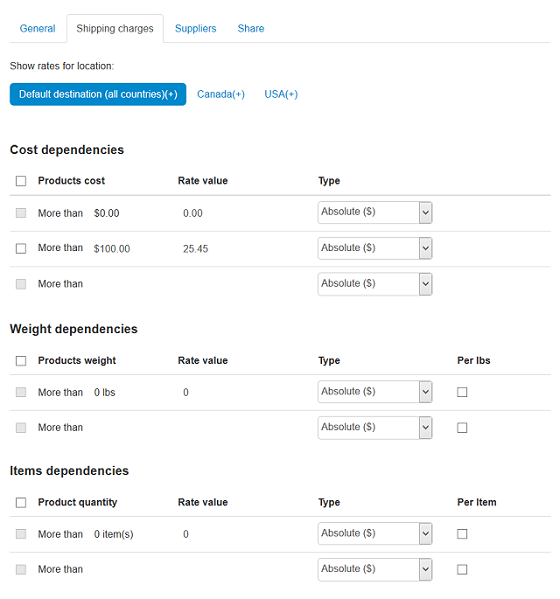

**************************
Shipping Method Attributes
**************************

General
*******

*	**Name** - Name of the shipping method as it appears on the storefront.
*	**Store** - Store to which the shipping method originally belongs.
*	**Icon** - Graphics to represent the shipping method.

	The graphics can be either uploaded from a local computer or the server file system or linked to a remote location where the required image is physically located.

	An alternative text describes the image and is shown when the image is missing or cannot be displayed. It is good practice to have an alternative text associated with the image as an additional SEO-wise opportunity.

	Images must be of one of the following formats only: JPEG, GIF, PNG. Maximum size of an uploaded image depends on your server configuration. As a rule, it should not exceed 2 MB.

.. note::

	Remember that the icon appears on the storefront in a special block with the content type **Shipping methods**. Make sure to create such a block in **Design > Layouts**.

*	**Delivery time** - Time until the order is delivered. This info is displayed on the storefront so that customers could decide if the delivery time meets their requirements.
*	**Weight limit** - Minimum and maximum weight of the order to be delivered through this method.
*	**Rate calculation** - Mode in which the shipping cost must be calculated: manual (table-based) or real-time.

	Table-based, or manual, calculation is based on the custom charges and rates that you define in the Shipping charges tab.

	Real-time calculation is based on the rates that your store receives from the carrier who will deliver the order. The rates are received in the real-time mode at the moment the order is being placed. In order to use the carrier-dependent estimation, you need to enable the support for the particular service provider in **Administration > Shipping and taxes > Shipping methods**.

	Carrier-specific settings are defined in the **Configure** tab.

*	**Shipping service** - Shipping service provider/carrier that will be in charge of delivering the order. This select box is available only if the rate calculation mode is set to Realtime.
*	**Test** - A special form to test the selected real-time shipping rate estimation service. Test estimation considers the weight that you specify in the form as well as the company (**Settings > Company**) and the default customer address (**Settings > General/Default location**).
*	**Taxes** - Tax rates that apply to the shipping method.
*	**User groups** (requires commercial license) - `User groups <http://www.cs-cart.com/documentation/reference_guide/index.htmld?users_user_groups.htm>`_ option whose members can choose to deliver their orders through this shipping method.
*	**Status** - Status of the shipping method: *Active* or *Disabled*.

Configure
*********

This tab appears only if you have selected real-time shipping rate calculation in the **General** tab of this section. Here you should configure the selected shipping service and specify its settings. Such settings vary depending on the shipping service provider. So, if you do not know what values/options should be entered or selected, please refer to the carrier's help pages and documentation.

 
Shipping charges
****************

The rates that you define here are used to calculate the shipping cost regardless of whether you use real-time shipping rate estimation or not. If you have chosen to receive rates from a carrier in the real-time mode, the charges from this section will be simply added to the carrier's charge. You can use this to add a shipping markup in order to compensate for your actual expenses if they exceed the values returned by the carrier (e.g., packing, insurance, etc.)

The rates can depend on the product cost, weight or quantity as well as being specific to the customer's location, when table-based rate calculation is used. To adjust the set of available locations, use section **Administration > Shipping & Taxes > Locations**.

*	**Product Cost/Weight/Quantity** - Minimum value when the rate must apply.
*	**Rate Value** - Shipping rate itself.
*	**Type** - Type of the rate: absolute monetary value or a percentage of the product cost.

Suppliers
*********

Pick suppliers for which this shipping method will be available. Choose **None** to make shipping method unavailable for suppliers.

.. note::

	This tab requires that you have the **Suppliers** add-on enabled in **Add-ons > Manage Add-ons**.

Share
*****

Stores that share this shipping method. Read `Sharing objects <http://www.cs-cart.com/documentation/reference_guide/index.htmld?store_sharing_options.htm>`_ for more details.