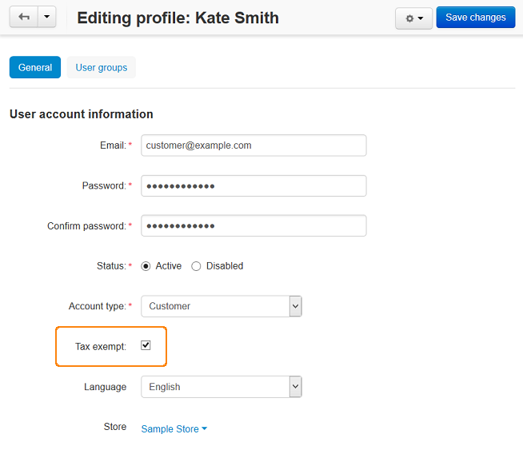

**********************************
How To: Make an Account Tax Exempt
**********************************

.. note::

    **Tutorial Difficulty: 1 / 3**  

    The **Tax exempt** checkbox is available only for the :doc:`Customer <../../users/customers/index>` type of user accounts. 

1. In the Administration panel, go to **Customers → Customers**.

2. Select an account which will be tax free.

3. In the **User account information** section tick the **Tax exempt** checkbox.

4. Click the **Save** button.

.. important::

       If you tick the **Price includes tax** checkbox when :doc:`setting up a tax <set_up_tax>`, customers won't be exempt from that tax.

