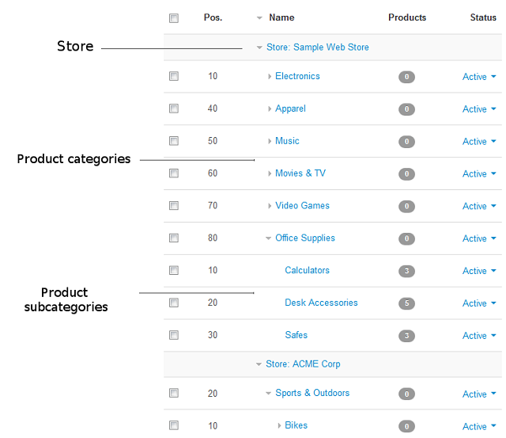

******************************
Multiple Stores and Cataloging
******************************

CS-Cart uses a common product catalog for all stores. The catalog has a tree structure: the root nodes represent stores; the child nodes inside a root node represent product categories and subcategories assigned to the corresponding store.

A single category cannot be assigned to more than one store at once. A product must always belong to a category or subcategory. So, a product becomes automatically assigned to a particular store depending on the position of the product's category in the common product catalog.

However, an individual product can be assigned to multiple product categories at once. That way you can share products among several stores and sell those products at different web stores.

.. important::
    Every shared product can have a number of store-specific properties, including the product name, description, price, etc.
