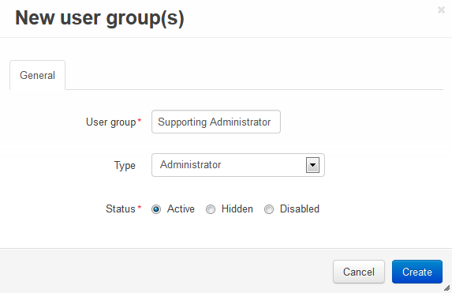
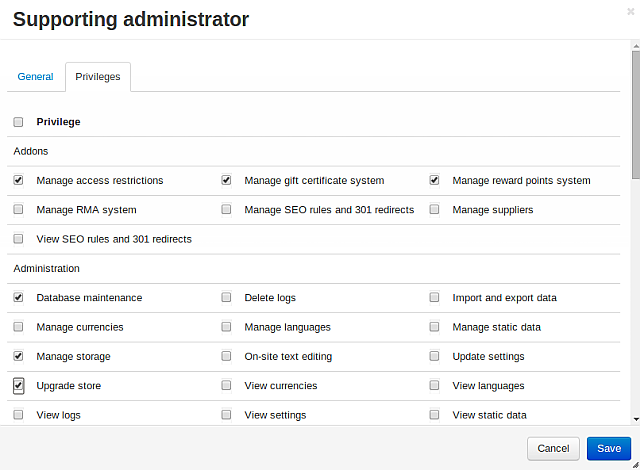

****************************************
How To: Create a New Administrator Group
****************************************

To create a new administrator group with limited rights, complete the steps below:

* In the Administration panel go to **Customers → User groups**.

* Click the **+** button on the right.

* Enter the name of your user group in the **User group** field.

* Set the **Type** to **Administrator**.

* Click the **Create** button.

* Open the newly created administrator group.

* Go to the **Privileges** tab. 

* Tick the checkboxes next to the privileges you want to enable for the group.

* Click the **Save** button.

To add a user to the group, complete the following steps:

* Go to **Customers → Administrators**.

* Click the desired username to open the profile.

* Switch to the **User groups** tab. 

* Set the status to **Active** for the group you've just created.

.. important::

    After this administrator logs in, he/she will have the privileges enabled for his/her user group only.

