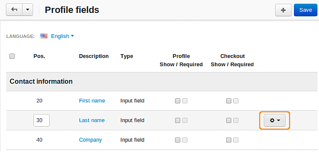
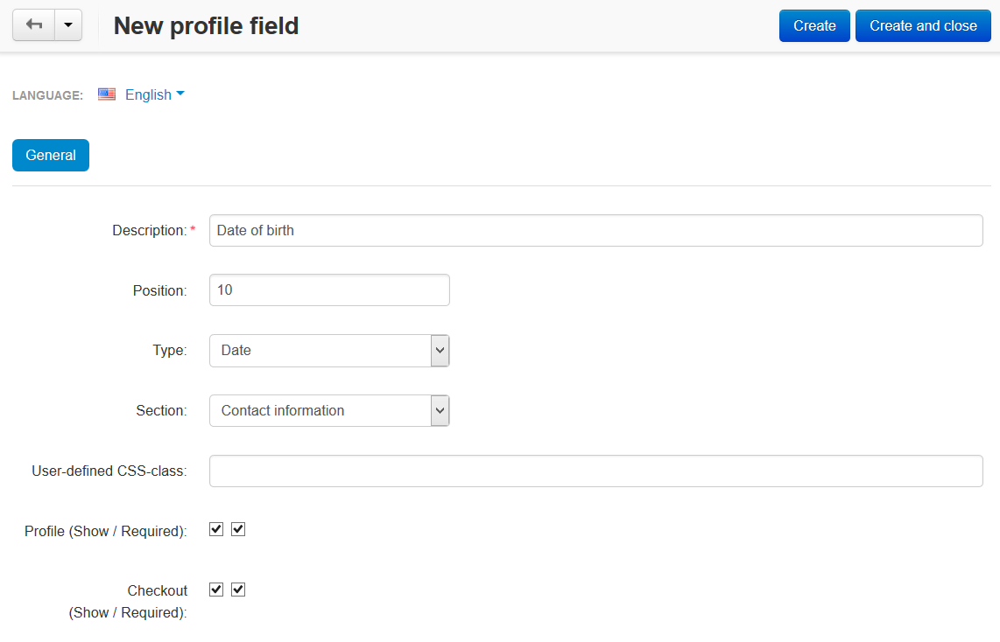

***************************
How To: Edit Profile Fields
***************************

To change any profile field, complete the following steps:

* In the Administration panel go to **Administration → Profile fields**.

* Click the **gear** button next to the desired profile field and choose **Edit**.

* Make your changes.

* Click the **Save** button to save the changes.

To add a new profile field, complete the following steps:

* Go to **Administration → Profile fields**.

* Click the **+** button on the right.

* Enter the information about the new profile field.

* Click the **Create** button.

