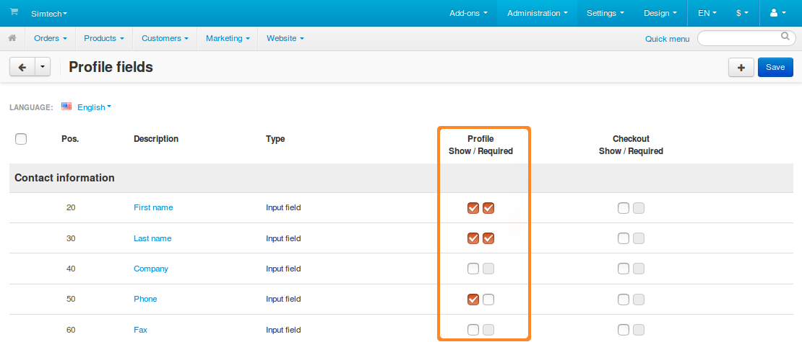

*****************************
How To: Manage Profile Fields
*****************************

Profile fields contain various information about a user. Users can fill in those fields when registering an account, in their profile, or at checkout. Some fields can be made mandatory.

The list of profile fields is available under **Administration → Profile fields**. On that page you can:

* Add, edit, hide, and delete profile fields.

* Determine whether or not a field is required.

.. image:: img/profile_fields.png
    :align: center
    :alt: The list of profile fields in the administration panel.

========================
Add/Edit a Profile Field
========================

1. To add a profile field, click the **+** button in the top right corner. To edit an existing profile field, click the **gear** button next to the desired field and choose **Edit**.

.. image:: img/add_or_edit_field.png
    :align: center
    :alt: The buttons that allow you to add a new field or edit an existing one.

2. You'll see a window where you'll be able to specify the properties of the profile field:

   * **Description**—the name of the field as it appears to customers and administrators.

   * **Position**—the position of this profile field on the list relative to other fields.

   * **Type**—the type of the profile field. It determines what kind of values can be entered or selected in the field. If you choose *Radio group* or *Multiple checkboxes*, you'll have to specify the possible variants on the **Variants** tab.

     .. important::

         Once you create a profile field, you won't be able to change the type of that field.

   * **Section**—determines whether this field is a part of user's contact information or billing/shipping address. If you choose *Billing/Shipping address*, you'll be able to configure whether or not to show or require that field separately in the billing and shipping address forms. 

   * **User-defined CSS class**—allows you to assign a custom CSS class to this field.

   * **Profile (Show/Required)**—the first checkbox makes the field appear during profile creation or editing. The second checkbox makes this field required—the user won't be able to create or update the profile without filling in this field.

   * **Checkout (Show/Required)**—the first checkbox makes the field appear at checkout. The second checkbox makes this field required—the user won't be able to complete checkout without filling in this field.

3. Once you've specified everything you needed, click **Create** (or **Save**, if you're editing an existing field).

.. image:: img/add_profile_field.png
    :align: center
    :alt: Specify the properties of the profile field.

=================================
Hide Fields or Make Them Required
=================================

The product field list has two columns that determine the areas where a field should appear: **Profile** and **Checkout**. 

Each area has two checkboxes:

* **Show**—the field appears in that area. 

  .. hint::

      If you want to disable a certain field without deleting it entirely, just untick the **Show** checkboxes for both **Profile** and **Checkout**.

* **Required**—the field must be filled in, or a user won't be able to proceed.

  * For profile that means that the user won't be allowed to register a new account or save the edited one, if the required field is empty.

  * For checkout that means that the user won't be able to submit an order if a required field is empty.

Once you configure the visibility of the profile fields, click **Save** in the top right corner. Otherwise your changes will be lost when you leave the page.

=====================
Delete Profile Fields
=====================

.. warning::

    Deleting a profile field will also delete the data that users entered in that profile field earlier. If you don't want that, just hide the profile field as described above.

Fields that exist by default can't be deleted. You can only delete custom profile fields:

* To delete one profile field, hover over it, click the **gear** button, and choose **Delete**.

* To delete multiple profile fields:

  1. Tick the checkboxes next to the fields you want to delete.

  2. Click the **gear** button in the top right corner.

  3. Choose **Delete selected**.

.. important::

     If a profile field belongs to the *Billing/Shipipng address* section, then the checkboxes and the **Delete** action under the **gear** button will only appear for the **Shipping address** form. Deleting a field like that will remove it both from the **Billing address** and the **Shipping address** forms.

.. image:: img/delete_profile_fields.png
    :align: center
    :alt: Deleting profile fields in CS-Cart.
