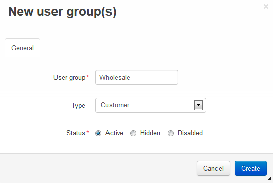
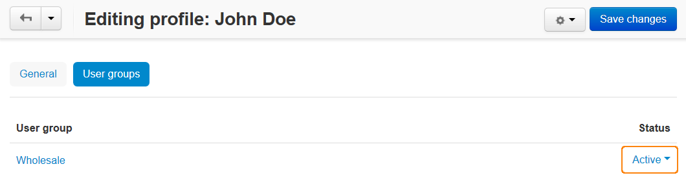

*********************************************
How To: Create a New User Group for Customers
*********************************************

==================
Create a New Group
==================

To create a new user group for customers, complete the steps below:

1. In the administration panel go to **Customers → User groups**.

2. Click the **+ button** on the right.

3. Enter the name your user group in the **User group** field.

4. Set the **Type** to **Customer**.

5. Click the **Create** button.

.. important::

    You can set different product price levels for different user groups. Go to **Products → Products**, click the desired product and switch to the **Quantity discounts** tab. 

    You can also determine what shipping methods, payment methods and discounts are available to different user groups.

======================
Add Users to the Group
======================

To add a user to the created user group, complete the following steps:

1. In the administration panel go to **Customers → Customers**.

2. Click the desired username to open the profile.

3. Switch to the **User groups** tab.

4. Set the status to **Active** for the group you've just created.

.. important::

    Customers will see prices of the corresponding user group only if they are a part of the group and are logged in to their accounts.

