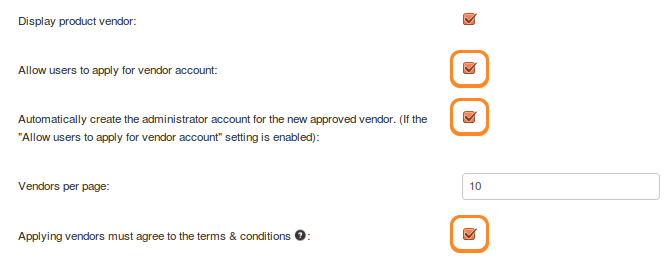
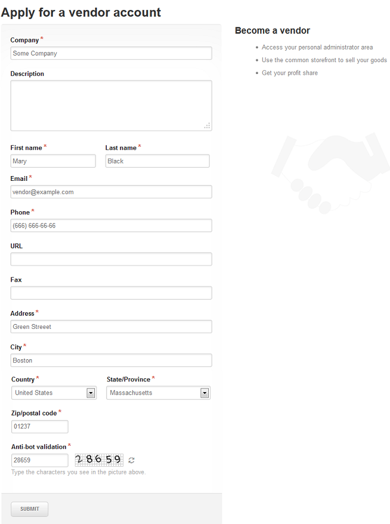
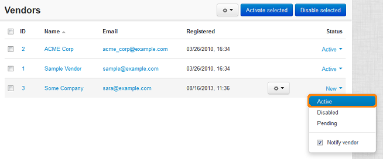

*****************************************************
How To: Allow Customers to Apply for a Vendor Account
*****************************************************

.. note::

    **Tutorial Difficulty: 1 / 3**

.. important::

    **Vendors** are available only in **Multi-Vendor**.

================================================
Allowing Customers to Apply for a Vendor Account
================================================

To allow customers apply for a vendor account, complete the following steps:

1. In the Administration panel, go to **Settings → Vendors**.

2. Tick the **Allow users to apply for vendor account** checkbox.

3. Tick the **Automatically create the administrator account for the new approved vendor. (If the "Allow users to apply for vendor account" setting is enabled)** checkbox.

4. If you want users to accept your terms and conditions before they can apply for a vendor account, tick the **Applying vendors must agree to the terms & conditions** checkbox.

   The text of the terms and conditions is stored the language variable called ``vendor_terms_n_conditions_content``. :doc:`Learn how to work with language variables <../../look_and_feel/languages/translate>`.

.. note::

    The terms and conditions for applying vendors first appeared in Multi-Vendor 4.3.7.

4. Click the **Save** button.

5. If you use Multi-Vendor 4.3.6 or higher, go to **Add-ons → Manage add-ons**, click **Vendor commissions** and enable the **Show "Apply for a vendor" link in "My account menu"** setting.

=======================
The Application Process
=======================

After that a customer will see the **Apply for a vendor account** link in the **My Account** dropdown menu. 

.. image:: img/apply_for_vendor.png
    :align: center
    :alt: A registered customer can apply for a vendor account using the My Account drop-down menu.

This link leads to the form that the customer must fill in to apply.

.. important::

   You can create the application link elsewhere manually. For example, you can create a :doc:`menu <../../look_and_feel/menus/index>` with an :doc:`item <../../look_and_feel/menus/menu_items>` that leads to ``dispatch=companies.apply_for_vendor``. This is useful when you use Multi-Vendor 4.3.6 or higher and disable or uninstall the **Vendor commissions** add-on.

After the customer fills out the form and clicks **Submit**, the administrator of the store can activate the newly created vendor account.

===========================
Activating a Vendor Account
===========================

To activate a vendor account, the administrator must complete the following steps:

1. Go to **Vendors → Vendors**.

2. Find the vendor account you want to activate.

.. hint::

    The vendor accounts that haven't been activated or disabled yet have the **New** status. 

3. Change the status of the desired account to **Active**.

.. hint::

    :doc:`Learn more about vendor statuses <vendor_statuses>` in the corresponding article of the documentation.

