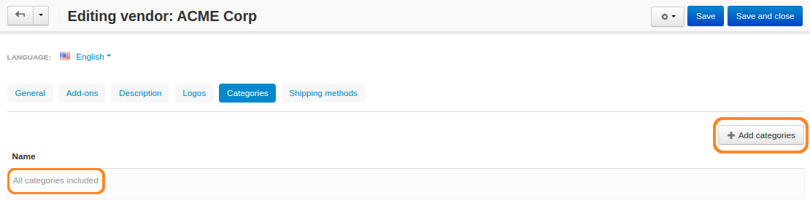
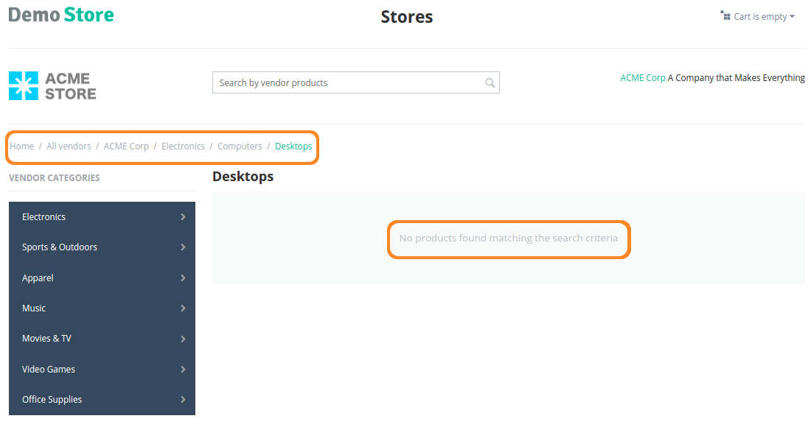

**********************
Vendors and Categories
**********************

.. important::

    **Vendors** are available only in **Multi-Vendor**.

By default, vendors can create products in all the categories of a store. However, you can make a list of categories available to a certain vendor. Then the vendor will be able to add products to those categories only.

===========================================
Change the Categories Available to a Vendor
===========================================

1. In the administration panel, go to **Vendors → Vendors → <Desired Vendor>**.

2. Switch to the **Categories** tab.

3. Use the **Add categories** button to add the categories to the list.

4. Click **Save** for the changes to take effect.

.. important::

    If there are no categories on the list, then the vendor will have access to all the categories of the store.

===================================
Categories in a Vendor's Microstore
===================================

Multi-Vendor has a feature called **vendor's microstore**, that shows the products of a specific vendor only.

-------------------------
Before Multi-Vendor 4.3.6
-------------------------

A vendor's microstore displayed all the categories available to the vendor. If the vendor had access to all categories, but didn't have products in some of them, those empty categories appeared in the microstore's menu.

------------------------
After Multi-Vendor 4.3.6
------------------------

Starting from Multi-Vendor 4.3.6, a vendor's microstore only displays the categories that have products.

.. important::

    A category will show up in a vendor's microstore even if it has hidden and/or disabled products only. The workaround is to move hidden/disabled products to a special hidden/disabled category created for that purpose.
