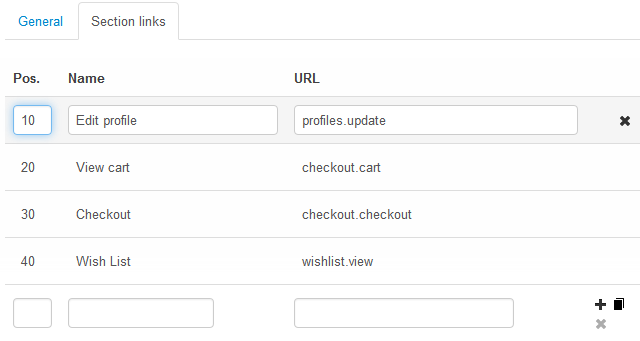

*******
Sitemap
*******

By default, the site map includes links to category and information pages only. You can go to **Website → Sitemap** to define a set of custom sections that should be included in the site map as well.

Each new section can nest additional links. To add nested links, click the **gear** button and choose the **Edit** action.
 
.. image:: img/manage_site_map.png
    :align: center
    :alt: You can add sections to the site map under Website → Sitemap.

==================
Section Attributes
==================

* **Name**—the name of the section as it appears on the map.

* **Status**—the status of the section—*Active* or *Disabled*.

===============
Link Attributes
===============

* **Position**—the position of the section link entry relatively to the position of the other section link entries on the map.

* **Name**—the name of the shortcut for the link as it appears on the map.

* **URL**—the URL of the page under the shortcut. It doesn't have to be an absolute URL with the access protocol, the domain name and the path to the page. A relative link like *index.php?dispatch=profiles.update* is enough.

